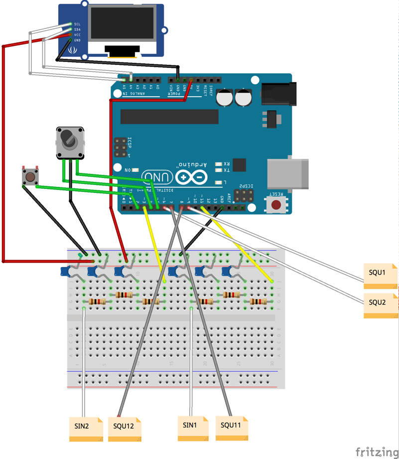

# simpleDDS
Simple software DDS based on Arduino, OLED, and rotary encoder

## 1. Purpose
  Simple DDS is designed to use test of oscilloscopes, but it can be used as a general oscillator.
  
## 2. Specifications
  * 2 x Sin wave (Up to 2KHz)
  * 2 x Square wave (sync with sin wave)
  * 2 x Square wave (Up to 8MHz)

## 3.Schematics
  
  
## 4. BOM
  1. Arduino Uno (or compatible)
  2. Rotary encoder with switch
  3. 128x64 I2C OLED
  4. 2 x RC Filter
   *  I used three stage low-pass filter (1K + 100nF) for test
  5. breadboard or Universal PCB
  6. several wires
  7. XY Oscilloscope for test

## 5. Usage
 * Main Menu:  channel select
    * -> Sub Menu: chennel parameter
      *  -> change frequency
      *  -> change phase (sin only)
      *  -> return to main menu

